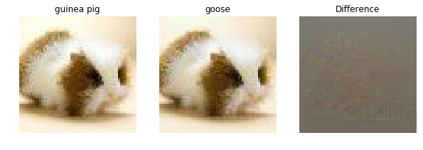

# Stanford CS231n CNN for Visual Recognition
Solution to 2016 & 2017 Course Assignments

This course is a deep learning treasure. It guides you to implement everything (machine learning models, CNN layers, backpropagation, optimizers, etc.) by hand with only lib of numpy. 
Though the process of implementing vectorized batch normalization backprop or convolutional filters are painful, it lays a solid fundation on one's understanding in deep learning. 
The visulizations (saliency map, class image generation) and applications (style transfer) help gain insight. 
Implementing more powerful models in Tensorflow/PyTorch is a good entry point to start building something fun.

## Assignment 1 - Put Together Image Classification

- construct the basic Image Classification pipeline
- understand split train/val/test splits and the use of validation data for hyperparameter tuning
- develop proficiency in writing efficient vectorized code with numpy
- implement [k-Nearest Neighbor (kNN) classifier](assignment1/knn.ipynb)
- implement [Multiclass Support Vector Machine (SVM) classifier](assignment1/svm.ipynb)
- implement [Softmax classifier](assignment1/softmax.ipynb)
- implement [Two layer neural network classifier](assignment1/two_layer_net.ipynb)
    - the hidden layer weights are visualized: 
    
  

- understand the differences and tradeoffs between these classifiers

## Assignment 2 - Train Deep Neural Networks
- implement [Fully Connected Nets](assignment2/FullyConnectedNets.ipynb)
    - vectorized backpropagation
    - modular layer design for arbitrary depth
    - implement optimization solver with SGD/Momentum/RMSProp/Adam update rules
- implement [Batch Normalization](assignment2/BatchNormalization.ipynb) to stably train deep networks
- implement [Dropout](assignment2/Dropout.ipynb) to regularize networks
- implement [Convolutional Nets on CIFAR-10](assignment2/ConvolutionalNetworks.ipynb)
    - implement convolutional layers
    - visualize filters and understand feature extraction, e.g. first layer filters are excited by pattern:
    
  

    - effectively cross-validate and find the best hyperparameters
    - 74% test classification accuracy is achieved by a CNN with only 4 layers on CIFAR-10 dataset, a test sample:
    
  

- implement [TensorFlow CNN on CIFAR-10](assignment2_2017/TensorFlow.ipynb)

## Assignment 3 - RNNs, GANs, & Image Gradients Applications
- [Image Captioning with Vanilla RNNs](assignment3/RNN_Captioning.ipynb)
    - implement recurrent layers and backpropagaation 
- [Image Captioning with LSTMs](assignment3/LSTM_Captioning.ipynb)
    - implement LSTM cell and backpropagation, cool results are collected:
    
 
     
     
    

- [Image Gradients: Saliency maps and Fooling Images](assignment3/ImageGradients.ipynb)
    - use pretrained model to compute gradients with respect to the image, and use them to produce saliency maps and fooling images
    - saliency map shows particular areas that excites classification:
    
  

    - fooling images modify pixels to fool classification result: 
    
  

- [Image Generation: Classes, Inversion, DeepDream](assignment3/ImageGeneration.ipynb)
    - visualize classes on empty pictures by gradient ascent on pixels. e.g. a king penguin:
    
  

    - feature inversion reconstructs image from features in a CNN layer
    - DeepDream repeatedly constructs (dreams) a image that amplify activations of a CNN layer:
    
  

- [Style Transfer](assignment3_2017/StyleTransfer-TensorFlow.ipynb)
    - paint images with content of one image but the *style* of another:
    
 
    
     
    

- [Generative Adversarial Networks](assignment3_2017/GANs-TensorFlow.ipynb)
    - train and implement a GAN to produce images that look like a dataset:
    
  

*Many thanks to CS231n instructors and TAs for creating such a meaty course.*