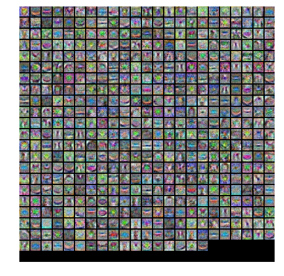
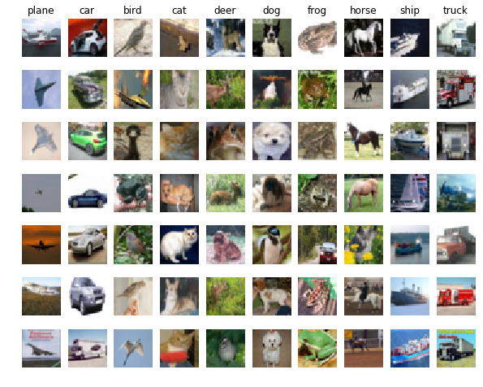

# Stanford CS231N CNN for Visual Recognition
Solution to 2016 & 2017 Course Assignments

## Assignment 1 - Put Together Image Classification

- construct the basic Image Classification pipeline
- understand split train/val/test splits and the use of validation data for hyperparameter tuning
- develop proficiency in writing efficient vectorized code with numpy
- implement [k-Nearest Neighbor (kNN) classifier](assignment1/knn.ipynb)
- implement [Multiclass Support Vector Machine (SVM) classifier](assignment1/svm.ipynb)
- implement [Softmax classifier](assignment1/softmax.ipynb)
- implement [Two layer neural network classifier](assignment1/two_layer_net.ipynb)
    - the hidden layer weights are visualized: 
    
  

- understand the differences and tradeoffs between these classifiers

## Assignment 2 - Train Deep Neural Networks
- implement [Fully Connected Nets](assignment2/FullyConnectedNets.ipynb)
    - vectorized backpropagation
    - modular layer design for arbitrary depth
    - implement optimization solver with SGD/Momentum/RMSProp/Adam update rules
- implement [Batch Normalization](assignment2/BatchNormalization.ipynb) to stably train deep networks
- implement [Dropout](assignment2/Dropout.ipynb) to regularize networks
- implement [Convolutional Nets on CIFAR-10](assignment2/ConvolutionalNetworks.ipynb)
    - implement convolutional layers
    - visualize filters and understand feature extraction, e.g. first layer filters are excited by pattern:
    
  

    - effectively cross-validate and find the best hyperparameters
    - 74% test classification accuracy is achieved by a CNN with only 4 layers on CIFAR-10 dataset, a test sample:
    
  

### Assignment 3
#### 1. Image Captioning with Vanilla RNNs
#### 2. Image Captioning with LSTMs
#### 3. Network Visualization
#### 4. Style Transfer
#### 5. Generative Adversarial Networks

### Many thanks to CS231n instructors and TAs for creating such a meaty course 